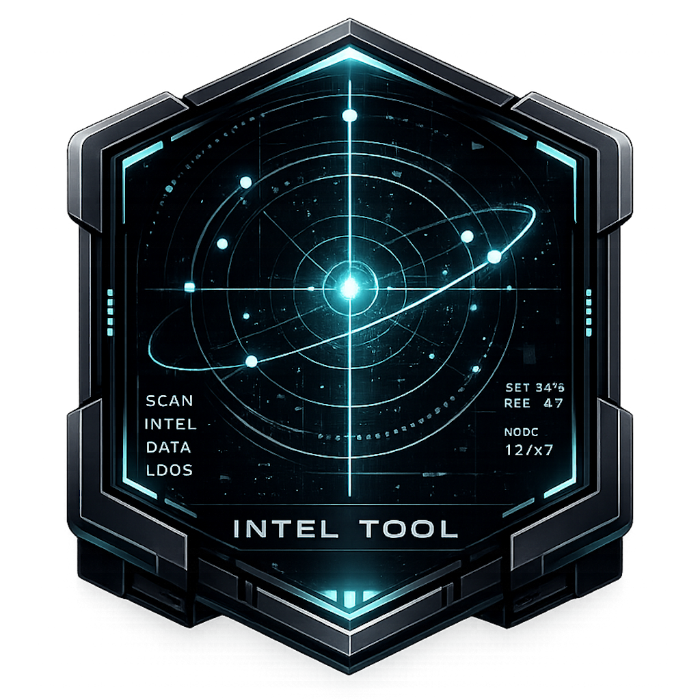

# SC Intel Tool

<p align="center">
  
</p>

SC Intel Tool is a Star Citizen desktop utility for player intel, organization context, local event tracking, mining and salvage planning, item finding, blueprint/crafting reference, Trading, Watchlists, and optional local OCR foundations.

## Current Status

The app is in active alpha development. Home, Event Center, Player Lookup, Search History, Mining / Salvage, Trading, Item Finder, BP Overview, Watchlists, Wikelo Items, Notes, Settings, AppData persistence, and packaged update checks are usable. BP Overview includes an optional local Reward Scanner alpha foundation with manual region selection; full OCR engine packaging remains planned for later.

Public Trading currently focuses on UEX Trading, Create Routes, Trade Routes, Best Buyer, En Route, Saved Routes, Commodities/Shops reference tools and local workflows backed by public UEX market data where available.

## Install And Run

### Development / Source Install

```powershell
python -m venv .venv
pip install -r requirements.txt
python main.py
```

Packaged releases include the public/minimal mining equipment data needed by the app. The local `reference_material/` folder is maintainer/developer-only and is not bundled wholesale in public releases.

### Packaged Release

Download the packaged release from [GitHub Releases](https://github.com/mrsaminus/SC-Intel-Tool/releases). For portable ZIP releases, extract the ZIP and run the executable inside the extracted folder. For current single-executable alpha releases, download and run `SC-Intel-Tool.exe` directly.

## Updates

The Settings tab shows the current app version and includes a `Check For Updates` button.

For normal users, updates should come from GitHub Releases:

[SC Intel Tool Releases](https://github.com/mrsaminus/SC-Intel-Tool/releases)

The in-app update check uses GitHub's public Releases API, so the repository or
release metadata must be public for normal users.

Packaged Windows builds can install updates from the Settings tab. The app
downloads the newest Windows executable, closes itself, and replaces the old
executable. When the installer reports success, start `SC-Intel-Tool.exe`
manually. Source/developer installs should update with git manually using
`git pull`.

User data is stored outside the install folder by default, so updates should preserve notes, lookup history, Event Center history, Wikelo checklist state, owned blueprint progress, Trading presets/routes, Watchlists, settings, and future local data.

## Privacy

SC Intel Tool has no telemetry, analytics, tracking, or user reporting. Player notes, lookup history, Event Center events, watchlists, settings, OCR text, screenshots, and local database data are not sent to the developer.

The app only makes outbound requests to public Star Citizen-related data sources needed for its features: RSI, UEX, Cornerstone, SC Focus, SC Craft Tools, the public Wikelo Google Sheet, and GitHub Releases for update checking. SCMDB is documented as a secondary BP Overview reference and may be used in a later enrichment pass. All user data remains local unless the user explicitly exports it.

The Reward Scanner is optional and off by default. It can visually select or manually enter a screen region, only reads that region when the user manually triggers a scan, and blueprint ownership changes require explicit confirmation.

## User Data

SC Intel Tool stores local user data outside the app install folder by default so updates do not remove notes, lookup history, Event Center events, Wikelo checklist state, owned blueprint progress, owned crafting materials, Trading presets/routes, Watchlists, settings, or future local data.

On Windows, the default user data folder is:

```text
%LOCALAPPDATA%\SC-Intel-Tool\
```

The SQLite database is stored there as:

```text
sc_intel.db
```

The Settings tab shows the active user data folder and database path. No local database data is sent to the developer.

To back up your data manually, close the app and copy the `SC-Intel-Tool` folder from `%LOCALAPPDATA%`. Restoring is the reverse: close the app, then copy the backed-up folder back to `%LOCALAPPDATA%`.

Advanced users and tests can override paths with environment variables:

```powershell
$env:SC_INTEL_DATA_DIR = "D:\SC-Intel-Tool-Data"
$env:SC_INTEL_DB_PATH = "D:\SC-Intel-Tool-Data\sc_intel.db"
```

`SC_INTEL_DB_PATH` takes precedence for the SQLite database. These overrides are local only and do not enable telemetry or cloud sync.

## Windows SmartScreen

Early alpha builds are unsigned, so Windows may show an "Unknown publisher" SmartScreen warning. Reducing this for normal users requires Authenticode code signing with a trusted certificate and release reputation over time.

## License And Reuse

The repository source is visible for transparency and project collaboration. No open-source license is currently granted, so the code, assets, and packaged builds may not be reused, redistributed, or republished without permission.

## Build A Windows Release

From the repository root:

```powershell
.\scripts\build_windows.ps1
```

The script installs runtime/dev requirements, builds a single-file Windows executable with PyInstaller, writes it to `dist/`, and prints the SHA256 checksum.

For a portable folder zip instead, run:

```powershell
.\scripts\build_windows.ps1 -Package OneDir
```

Release checklist:

1. Update `APP_VERSION` in `app/version.py`.
2. Update `CHANGELOG.md`.
3. Run compile/test validation locally:
   `.\.venv\Scripts\python.exe -m compileall main.py app` and
   `.\.venv\Scripts\python.exe -m pytest`.
4. Run `.\scripts\build_windows.ps1`.
5. Create a GitHub Release with a matching tag, for example `v0.1.0-alpha.8.5`.
6. Upload `SC-Intel-Tool.exe` and include the SHA256 checksum in the release notes.

For the full stabilization checklist, see `docs/beta_readiness_checklist.md`.

## Roadmap

See `ROADMAP.md`.
